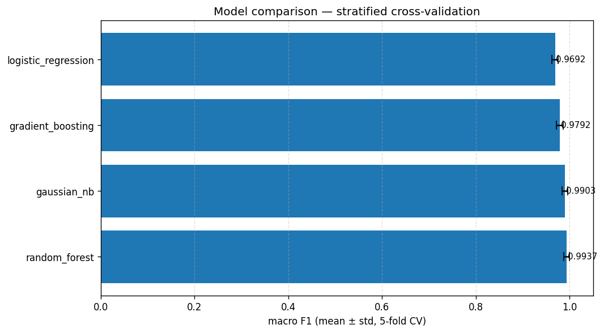

# Crop Recommendation System

[](https://github.com/pedroberiotto/crop-recommendation-system/actions/workflows/ci.yml)
[](https://www.python.org/downloads/)
[](https://fastapi.tiangolo.com/)
[](https://scikit-learn.org/)
[](https://www.docker.com/)
[](LICENSE)

Crop recommendation system from soil and climate sensor readings (N, P, K, temperature, humidity, pH, rainfall). Covers the complete lifecycle of an ML production problem: EDA, modeling with cross-validation, REST API with SHAP explainability, structured observability, and container packaging.

- **Model:** `RandomForestClassifier` selected by macro F1 on stratified 5-fold CV, across 22 crops (99% accuracy on the test set).
- **API:** FastAPI — `POST /predict` (single + batch up to 500), `GET /health`, `GET /model/info`, `POST /model/rollback`.
- **Containerization:** `python:3.11-slim` image < 800 MB, `docker-compose` with API service + log collector.
- **Explainability:** SHAP integrated, activated only for `confidence > 0.70`, controllable via `?explain`.
- **Observability:** structured JSON logs on stdout, with per-request latency and model version diagnostics.

---

## Stack

| Layer | Tools |
|---|---|
| Modeling | `scikit-learn`, `pandas`, `numpy`, `shap` |
| Tracking | `MLflow` (SQLite backend) |
| API | `FastAPI`, `pydantic`, `uvicorn` |
| Container | `Docker`, `docker-compose` |
| Tests | `pytest` (unit + integration + smoke) |
| Build | `Makefile`, `pyproject.toml` |

---

## Results

Test set (20% stratified, `random_state=42`):


Comparison of models evaluated on 5-fold CV:



Full classification report at [`reports/figures/classification_report.txt`](reports/figures/classification_report.txt). Analysis of remaining errors at [`reports/real_confusion_analysis.md`](reports/real_confusion_analysis.md).

---

## Prerequisites

- Python 3.10+ and `make` (local flow)
- Docker + Docker Compose (containerized flow)

---

## Quickstart — local flow

Runs directly on the machine using a virtualenv in `.venv/`:

```bash
make install            # creates .venv and installs requirements.txt + package in editable mode
make download           # downloads the dataset from Kaggle to data/raw/Crop_recommendation.csv
make train              # 5-fold CV, trains the best model, saves artifacts/final_model.pkl
make api                # starts the API at http://localhost:8000
```

Full sequence with test gates:

```bash
make install
make download
make test-unit          # gate before training
make train              # already depends on test-unit
make test-integration   # FastAPI TestClient
make test-smoke         # artifact compatibility
make api
```

`make train` generates:

- `artifacts/final_model.pkl` — pipeline + classifier
- `artifacts/final_model_meta.json` — sidecar with `sklearn_version` for compatibility diagnostics
- `artifacts/model_v1.pkl` (and `model_vN.pkl` on subsequent runs) — backups for rollback
- `reports/cv_results.csv` — CV results
- `reports/real_confusion_analysis.md` — error table derived from the real confusion matrix
- `reports/figures/{confusion_matrix,cv_model_comparison}.png` + `classification_report.txt`

To inspect experiments in MLflow:

```bash
make mlflow-ui          # UI at http://localhost:5000
```

---

## Quickstart — Docker

Packages the API in the production image and starts it alongside the log collector:

```bash
make docker-train       # (optional) trains inside the container — useful if you don't want a local virtualenv
make docker-up          # build + starts the `api` and `log-reader` services
make docker-logs        # follows JSON logs in real time
make docker-mlflow      # (optional) MLflow UI at http://localhost:5050
make docker-down        # tears everything down
```

> **Important:** `make docker-up` requires `artifacts/final_model.pkl` to exist on the host (compose mounts `./artifacts` as a volume). Use `make train` locally or `make docker-train` before the first `make docker-up`.

The API responds at `http://localhost:8000`:

- `http://localhost:8000/docs` — Swagger UI
- `http://localhost:8000/health` — status
- `http://localhost:8000/model/info` — active model metadata

---

## Using the API

### Single prediction

```bash
curl -s -X POST http://localhost:8000/predict \
  -H "Content-Type: application/json" \
  -d '{
    "records": [{
      "N": 90, "P": 42, "K": 43,
      "temperature": 20.9, "humidity": 82.0,
      "ph": 6.5, "rainfall": 202.9
    }]
  }' | python3 -m json.tool
```

Response:

```json
{
  "predictions": [
    {
      "crop": "rice",
      "confidence": 0.91,
      "alternatives": [
        {"crop": "jute",  "probability": 0.05},
        {"crop": "maize", "probability": 0.02},
        {"crop": "cotton","probability": 0.01}
      ],
      "explanation": [
        {"feature": "rainfall",  "value": 202.9, "impact": "positive"},
        {"feature": "humidity",  "value": 82.0,  "impact": "positive"},
        {"feature": "NPK_sum",   "value": 175.0, "impact": "negative"}
      ]
    }
  ]
}
```

### Batch (up to 500 records)

```python
import httpx

records = [
    {"N": 90, "P": 42, "K": 43, "temperature": 20.9,
     "humidity": 82.0, "ph": 6.5, "rainfall": 202.9}
] * 500

resp = httpx.post(
    "http://localhost:8000/predict?explain=false",
    json={"records": records},
    timeout=30.0,
)
print(len(resp.json()["predictions"]), "predictions")
```

### Model rollback

```bash
curl http://localhost:8000/model/info | python3 -m json.tool

curl -X POST http://localhost:8000/model/rollback \
  -H "Content-Type: application/json" \
  -d '{"artifact": "model_v1.pkl"}'
```

### Inputs outside the physical domain

Two modes, controlled via the `?strict` query parameter:

- `?strict=true` (default) — values outside the physical range return HTTP 422 (Pydantic).
- `?strict=false` — accepts any number, clips via `PhysicalBoundsClipper`, and the structured request log is emitted with `input_modified=true`.

```bash
curl -X POST "http://localhost:8000/predict?strict=false" \
  -H "Content-Type: application/json" \
  -d '{"records": [{"N": 90, "P": 42, "K": 43,
                    "temperature": 20.9, "humidity": 150.0,
                    "ph": -1.0, "rainfall": 202.9}]}'
```

---

## Modeling

Four models evaluated with distinct justifications:

| Model | Justification |
|---|---|
| `LogisticRegression` | Linear baseline; cheap SHAP LinearExplainer |
| `GaussianNB` | Probabilistic baseline; reveals the cost of the independence assumption |
| `RandomForestClassifier` | Robust, fast TreeExplainer for SHAP — **winner by macro F1** |
| `GradientBoostingClassifier` | Tree-based comparator without heavy external dependency |

Validation:

- Stratified 80/20 split with `random_state=42`
- `StratifiedKFold(n_splits=5, shuffle=True)` only on the training set
- Pipeline cloned per fold → zero leakage from `StandardScaler` (test `tests/test_preprocessing.py::TestNoDataLeakage`)
- Metrics: `accuracy` and `macro F1` (mean ± std)
- Selection by `f1_macro_mean`

Error analysis (last run, generated in `reports/real_confusion_analysis.md`):

- 5 errors in 440 samples (99% accuracy)
- Confused pairs: `lentil→mothbeans` (2), `blackgram→{maize,mothbeans}` (1+1), `rice→jute` (1)
- `mothbeans` is the "absorbing" class (precision 0.87 — the lowest in the test set, recall 1.00). In production, `mothbeans` predictions with `confidence < 0.85` may trigger human confirmation.

---

## Observability

JSON logs on stdout (and in `/logs/api.log` inside the container):

```json
{
  "timestamp": "2026-05-19T18:00:00.000000+00:00",
  "level": "INFO",
  "logger": "api.request",
  "message": "predict",
  "endpoint": "/predict",
  "latency_ms": 12.4,
  "batch_size": 1,
  "model_artifact": "final_model.pkl",
  "input_modified": false
}
```

Follow in real time:

```bash
make docker-logs
```

---

## Explainability latency

Local measurement with `FastAPI TestClient`, batch of 50 records, 20 calls per scenario:

| Scenario | P50 | P99 |
|---|---:|---:|
| `?explain=false` (no SHAP) | 26.1 ms | 27.9 ms |
| `?explain=true` + SHAP | 231.4 ms | 242.6 ms |

`?explain=true` is the default. `?explain=false` is provided for batch monitoring pipelines where the explanation is unnecessary.

---

## sklearn version mismatch diagnostics

`joblib` does not persist the sklearn version as structured metadata: `BaseEstimator.__setstate__` pops `_sklearn_version` on unpickle, so the attribute **does not survive** the reload. The diagnostic relies on a sidecar JSON (`final_model_meta.json`) written at serialization time — this is the only source of truth.

Layered mechanisms:

1. `ModelStore.load()` reads the sidecar on every load and emits a `sklearn_version_mismatch` structured log event if it diverges from the runtime.
2. `requirements-api.txt` pins `scikit-learn==1.7.2` (same version recorded in the current sidecar).
3. Smoke test `tests/smoke/test_artifact_compat.py::test_sklearn_version_compatible` compares `meta["sklearn_version"]` against `sklearn.__version__` and fails CI if they diverge.
4. `scripts/simulate_version_mismatch.py` allows reproducing the scenario without installing an older sklearn:

   ```bash
   python scripts/simulate_version_mismatch.py        # generates model_v_legacy.pkl with a forged sklearn_version

   curl -X POST http://localhost:8000/model/rollback \
     -H "Content-Type: application/json" \
     -d '{"artifact": "model_v_legacy.pkl"}'
   ```

   The API JSON log then emits a `sklearn_version_mismatch` event with `version_train` ≠ `version_runtime`.


---

## Tests

Three layers, all running via `pytest`:

```bash
make test               # runs everything
make test-unit          # preprocessing and modeling logic
make test-integration   # API via FastAPI TestClient (predict, health, rollback)
make test-smoke         # loaded artifact compatibility (sklearn version, classes, etc.)
```

The `make train` target depends on `test-unit` — it is not possible to train with a broken base.

---

## Repository structure

```
crop-recommendation-system/
├── data/raw/                       Crop_recommendation.csv (gitignored — download via `make download`)
├── artifacts/                      final_model.pkl + meta + backups model_vN.pkl (gitignored)
├── mlflow/                         SQLite backend + MLflow artifacts (gitignored)
├── reports/
│   ├── cv_results.csv
│   ├── real_confusion_analysis.md
│   └── figures/                    confusion_matrix.png, cv_model_comparison.png, classification_report.txt
├── notebooks/01_eda_preprocessing.ipynb
├── src/crop_reco/                  installable Python module (preprocessing, modeling, explainability, ...)
├── scripts/
│   ├── download_data.py
│   ├── train_models.py             full training pipeline + MLflow + error analysis
│   ├── build_pipeline.py
│   └── simulate_version_mismatch.py
├── app/
│   ├── main.py                     FastAPI + lifespan
│   ├── model_store.py              thread-safe, rollback, sklearn diagnostics
│   ├── schemas.py                  Pydantic
│   └── routers/                    health, predict, model
├── tests/
│   ├── unit/                       modeling logic
│   ├── integration/                TestClient: predict, health, rollback
│   ├── smoke/                      artifact compatibility
│   └── test_{data,eda,preprocessing}.py
├── Dockerfile                      production API
├── Dockerfile.train                training image (mlflow, kagglehub)
├── docker-compose.yml              api + log-reader + train/mlflow (profiles)
├── requirements.txt                full dependencies (training + EDA + tests)
├── requirements-api.txt            API runtime dependencies
├── Makefile
├── pyproject.toml
├── .github/workflows/ci.yml        CI: unit + integration tests on Python 3.10–3.12
├── LICENSE                         MIT
└── README.md
```

---

## Environment variables

| Variable | Default | Description |
|---|---|---|
| `ARTIFACTS_DIR` | `./artifacts` | Artifacts directory (overridden by compose to `/artifacts`) |
| `MODEL_ARTIFACT` | `final_model.pkl` | Artifact to load at API startup |
| `LOG_FILE` | `` | Path for file logging (empty = stdout only) |
| `MLFLOW_TRACKING_URI` | `sqlite:///mlflow/mlflow.db` | MLflow backend |

---

## Model versioning notes

The `.gitignore` in this repo ignores `*.pkl` by default — models are reproduced with `make train` from the dataset. To version artifacts directly:

```bash
# 1. Install Git LFS
git lfs install

# 2. Edit .gitattributes and uncomment the line:
#    *.pkl filter=lfs diff=lfs merge=lfs -text

# 3. Remove *.pkl from .gitignore

# 4. Commit normally — Git LFS will handle the storage
```

---

## Dataset

[Crop Recommendation Dataset](https://www.kaggle.com/datasets/atharvaingle/crop-recommendation-dataset) — Atharva Ingle, Kaggle. 2200 records, 22 crops, 7 numerical features.

---

## License

[MIT](LICENSE).
